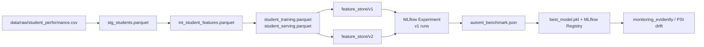

```mermaid
graph LR
    A[data/raw/student_performance.csv] --> B[stg_students.parquet]
    B --> C[int_student_features.parquet]
    C --> D[student_training.parquet<br/>student_serving.parquet]
    D --> E1[feature_store/v1]
    D --> E2[feature_store/v2]
    E1 --> F[MLflow Experiment<br/>v1 runs]
    E2 --> F
    F --> G[automl_benchmark.json]
    G --> H[best_model.pkl + MLflow Registry]
    H --> I[monitoring_evidently / PSI drift]
```
